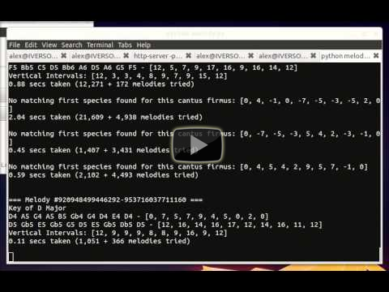

melody.py
=========

**melody.py** generates random 10-note [first species counterpoint](http://en.wikipedia.org/wiki/Counterpoint#First_species) melodies by first finding a random *cantus firmus* melody that matches a set of heuristics and then finding an appropriate counterpoint melody. A total of [16 heuristics](https://github.com/AlexNisnevich/melody.py/blob/master/melody.py#L81-L212) are used for each individual melody and [4 heuristics](https://github.com/AlexNisnevich/melody.py/blob/master/melody.py#L214-L239) are used to match two melodies in counterpoint. Results are outputted as MIDI files using Pyknon and then played using Timidity.

### Table of Contents

1\.  [Try It Now!](#tryitnow!)  
2\.  [Video Demonstration](#videodemonstration)  
3\.  [Usage](#usage)  
3.1\.  [Installation - Ubuntu / Debian](#installation-ubuntu/debian)  
3.1.1\.  [Command-line interface](#command-lineinterface)  
3.1.2\.  [Web interface](#webinterface)  
3.2\.  [Installation - Other](#installation-other)  
3.2.1\.  [Command-line interface](#command-lineinterface-1)  
3.2.2\.  [Web interface](#webinterface-1)  
3.3\.  [Running melody.py](#runningmelody.py)  
3.3.1\.  [Command-line interface](#command-lineinterface-2)  
3.3.2\.  [Web interface](#webinterface-2)  
4\.  [Heuristics Used](#heuristicsused)  
4.1\.  [For each individual melody](#foreachindividualmelody)  
4.2\.  [To match cantus firmus melody to first species melody](#tomatchcantusfirmusmelodytofirstspeciesmelody)  
5\.  [Wish List](#wishlist)  

<a name="tryitnow!"></a>

### 1\. Try It Now!

I've spun up an [Amazon EC2 instance](http://ec2-54-184-67-209.us-west-2.compute.amazonaws.com/).

<a name="videodemonstration"></a>

### 2\. Video Demonstration

[](http://www.youtube.com/watch?v=8cF6pfrD4RM)

<a name="usage"></a>

### 3\. Usage

You can use melody.py through the command-line or by running a small web server. The advantage of the latter is that you'll also be able to see generated sheet music.

<a name="installation-ubuntu/debian"></a>

#### 3.1\. Installation - Ubuntu / Debian

<a name="command-lineinterface"></a>

##### 3.1.1\. Command-line interface

```
sudo apt-get install python-pip timidity
pip install pyknon
```

<a name="webinterface"></a>

##### 3.1.2\. Web interface

Same as above, then
```
pip install flask
```

Also, make sure [FFmpeg](http://www.ffmpeg.org/) is installed.

<a name="installation-other"></a>

#### 3.2\. Installation - Other

<a name="command-lineinterface-1"></a>

##### 3.2.1\. Command-line interface

Install [Pyknon](http://kroger.github.com/pyknon/) and [Timidity](http://timidity.sourceforge.net/).

<a name="webinterface-1"></a>

##### 3.2.2\. Web interface

Also install [Flask](http://flask.pocoo.org/) and [FFmpeg](http://www.ffmpeg.org/).

<a name="runningmelody.py"></a>

#### 3.3\. Running melody.py

<a name="command-lineinterface-2"></a>

##### 3.3.1\. Command-line interface
```
python melody.py
```
will loop forever, generating new melodies continuously. Mash Ctrl-C a few times to stop it.

<a name="webinterface-2"></a>

##### 3.3.2\. Web interface
```
python app.py
```

Then go to `localhost:5000` (or whatever port is chosen).

<a name="heuristicsused"></a>

### 4\. Heuristics Used

<a name="foreachindividualmelody"></a>

#### 4.1\. For each individual melody

Both the cantus firmus and the first species must satisfy the following rules:

1. No repeated notes in cantus firmus (one repetition allowed in first species).
2. No leaps that are an octave or larger.
3. No dissonant leaps.
4. Between two and four leaps in total.
5. Has a climax (highest note) that is not on the tonic or leading tone.
6. Changes direction at least two times.
7. No note repeated more than 3 times.
8. Final note approached by a step (not a leap).
9. Leaps larger than M3 must be followed by a change of direction.
10. The leading tone must always be followed by the tonic.
11. No more than two consecutive leaps in the same direction.
12. The same interval cannot occur twice in a row.
13. No noodling (that is, patterns such as N1 N2 N1 N2, for some notes N1 and N2).
14. No runs of more than four consecutive notes.
15. No unresolved melodic tension (that is, the start and end note of each run must be consonant together).
16. No repeated three-note patterns.

<a name="tomatchcantusfirmusmelodytofirstspeciesmelody"></a>

#### 4.2\. To match cantus firmus melody to first species melody

Together, the cantus firmus and the first species must satisfy the following:

1. No dissonant vertical intervals.
2. No vertical intervals larger than a 12th (P8 + P5).
3. No parallel fifths or octaves.
4. No parallel three-note chains.

<a name="wishlist"></a>

### 5\. Wish List

- minor key support
- support for other kinds of counterpoint
- support for melodies of other lengths (with rules tuned appropriately)
- ability to import existing cantus firmus (as MIDI or note array)
- minor: treating repeated notes as a single note of double duration rather than two separate notes
